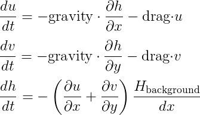

# Shallow Ocean Waves

The Python script solves the _shallow water equations_, a simplified version of Navier-Stokes:

<p align="center"></p>

The square domain wraps around in all corners, almost as if it was on a small planet. It was inspired by The University of Chicago's MOOC, [Global Warming II: Create Your Own Models in Python](https://www.coursera.org/learn/global-warming-model).

The equations are solved with the simplest possible method, forward Euler. As this method is only conditionally stable, we estimate the error in each timestep and adaptively reduce the step size if it is too large.

### Installation

The script should be run with Python 3. Clone or download this repository then install the necessary Python modules using pip:

```bash
pip3 install -r requirements.txt
```

### Usage

Simply execute the script and you should get a 2D video of the waves!

```
python3 shallow_ocean_waves.py
```

<p align="center"></p>

The various parameters can be tweaked with human-readable units. For example, to have the waves decay over a longer timescale:

```
python3 shallow_ocean_waves.py --decay "1 month"
```

### Development

The repository includes a bunch of tests, which you can run like so:

```
python3 tests.py
```

There are a few extensions I'd like to do if I get the time:

 * Solve the equations on the surface of a sphere rather than a plane.
 * Add Coriolis and wind forces.
 * Adaptively take larger steps if the error is too small: currently the step size only gets smaller.
